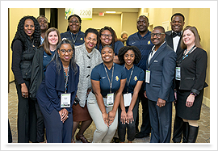

### <i class="fa fa-fw fa-user-graduate" aria-hidden="true"></i> Undergraduate Research Mentorship

Deciding to go to graduate school is a big decision. One thing that helped me make the decision was the opportunity to partake in undergraduate research. Now a professor, I am happy to have the chance to pay that experience forward.

You can see the awesome undergraduate I have given REU appointments to under the student tab. 

## Undergraduate Mentorships
* **AMIE Design Challenge hosted at the BEYA conference:** Mentoring students as they develop a student-led solution for a student identified problem in the healthcare sector. (Industry sponsor: NetApp 2019, Apple 2020). 
* **AutoDrive Challenge:** Mentoring 3 undergraduate students across the mapping and functional safety challenges. The AutoDrive challenge is an applied research project where the students gradually work towards building a self-driving car over a 3 year time period. 

 &nbsp;&nbsp; 

### <i class="fa fa-fw fa-chalkboard-teacher" aria-hidden="true"></i> Undergraduate Education and Curriculum

Undergraduate education is our chance to make the largest impact on our field, because we get the opportunity to build up all our students into productive members of the computer science community. 

## Professional Development 
* **\[Summer 2019\] Google FIR:** FIR is an immersive professional development program that engages CS faculty serving underrepresented populations in tech.  Our focus is on industry-informed, applied learning projects. 
* **\[Fall 2018\] Re-designed Comp 285:** I co-designed my "Comp 285: Design and Analysis of Algorithms" course with one of my PhD committee members, Dr. Julien from the University of Texas at Austin.
* **\[August 2018\] Facebook's T3 Faculty Summit** dedicated to developing Data Structures and Algorithms curriculum.

### <i class="fa fa-fw fa-school" aria-hidden="true"></i> K-12 Outreach

Often, we follow the career paths of the people around us. Most high schools do not expose students to the diverse array of STEM majors 
(*you are often lucky if you have a computer science class offered let alone a mechanical or electrical engineering course*). This is why STEM outreach is so important. 

## Activities
* **Triad Programming Contest:** I am the organizer and main judge for the Triad Programming Contest, hosted by NC A&T State University. The contest is offered annual and open to both high school and colleges in the greater Triad area.
* **FIRST LEGO League State Championships volunteer:** On February 2nd and 3rd, approximately 900 4th through 8th grade students from across the state of North Carolina will come to NC A&T campus to compete at the FIRST LEGO League (FLL) State Championships.
